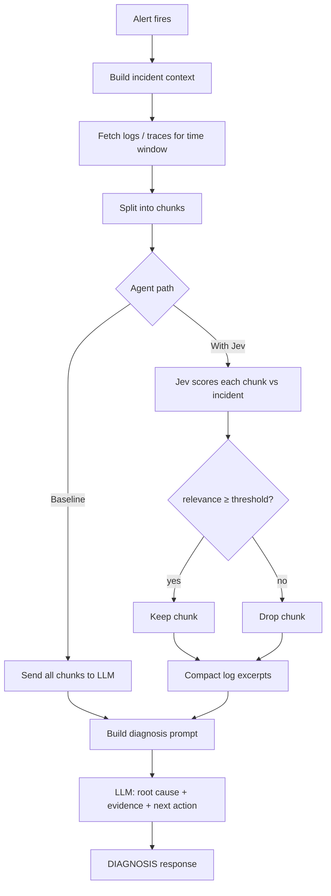

# Jev Log Relevance Filter

Demonstrates using **Jev** (TypeSafe's System One model) to score log and trace chunks for anomaly relevance **before** passing context to a diagnostic LLM — reducing tokens and cost without dumping raw observability data into the context window.

## The problem

Diagnostic agents often receive massive log exports or Datadog trace dumps. Stuffing everything into the LLM context window explodes **tokens, cost, and latency**. Most lines are noise.

## The approach

```
All log chunks ──► [Agent A] entire dump ──► LLM diagnosis

All log chunks ──► [Agent B] Jev scores each chunk ──► high-signal only ──► LLM diagnosis
```

| | Agent A (Baseline) | Agent B (With Jev) |
| --- | --- | --- |
| Context | All log/trace chunks | Only relevance-filtered chunks |
| Jev role | None | `Noul` score per chunk: anomaly-relevant to this incident? |
| LLM role | Diagnose from full context | Diagnose from compact context |

Both single-pass agents use the same LLM, prompts, and mocked scenarios.

### Agentic mode (tool calling + fetch loop)

Agents C and D add a **ReAct loop**: the LLM starts with incident context only and calls tools to gather evidence.

```
Alert → incident context (no logs yet)
  → LLM turn 1: fetch_logs(severity=ALL)
  → tool returns excerpts (Jev filters each fetch in Agent D)
  → LLM turn 2: need more → fetch_logs(severity=ERROR)
  → LLM turn 3: submit_diagnosis(...)
```

| | Agent C (`agentic`) | Agent D (`agentic_jev`) |
| --- | --- | --- |
| Log access | `fetch_logs` tool (mock store) | Same |
| Per-fetch filtering | None — all fetched chunks shown | Jev scores each fetch batch |
| LLM calls | Multiple (reason → act → observe) | Multiple |
| Recovery | Can re-fetch if context insufficient | Same + compact excerpts per fetch |

```bash
python scripts/test_agentic.py --scenario oom_heap_exhaustion
JEV_MODE=live python scripts/test_agentic.py --scenario oom_heap_exhaustion --jev
python run_benchmark.py --agents agentic,agentic_jev --runs 1 --scenarios oom_heap_exhaustion
```

## End-to-end flow (alert → LLM response)

In production, an on-call alert kicks off the pipeline. This repo mocks that path with YAML scenarios and sample log files — the steps are the same.



### Step by step (Agent B — with Jev)

| Step | What happens | In this repo |
| --- | --- | --- |
| 1. **Alert** | Pager/monitor fires (OOM, CrashLoop, latency spike, etc.) | Scenario `incident` block or `samples/incident-*.yaml` |
| 2. **Incident context** | Title, service, symptoms, metrics summary attached to the run | `scenario.incident`, `metrics_summary`, `runbook_excerpt` |
| 3. **Fetch logs** | Pull log/trace export for the affected service and time range | Mock `log_chunks` in `scenarios/` or `.log` files in `samples/` |
| 4. **Chunk** | Split raw lines into windows (blank-line or fixed-size blocks) | `scripts/log_utils.py` → `chunk_by_blank_lines()` |
| 5. **Score** | Jev asks: *does this chunk help diagnose this incident?* → relevance 0–1 | `jev/chunk_scorer.py` → `ChunkRelevanceScorer.score_chunk()` |
| 6. **Filter** | Keep chunks ≥ `RELEVANCE_THRESHOLD`; drop the rest (`JEV_MODE=live`) | `filter_chunks()` — shadow mode scores but passes all |
| 7. **Prompt** | System prompt + incident block + **only filtered** log excerpts | `agents/common.py` → `build_diagnosis_prompt()` |
| 8. **Diagnose** | LLM returns `DIAGNOSIS:` with root cause, evidence, recommended action | `invoke_llm_diagnosis()` via LangChain + OpenAI |
| 9. **Evaluate** | Check diagnosis keywords and signal recall (benchmark only) | `evaluate_diagnosis()` in benchmark runs |

**Baseline (Agent A)** skips steps 5–6: all chunks go straight to the prompt in step 7.

### Example data flow

```
Alert:     "Pod OOMKilled — report-generator"
Context:   service, symptoms, memory metrics
Logs:      8 chunks (6 noise + 2 signal)
Jev:       2 chunks pass (OOM / heap errors)
LLM input: incident summary + 2 excerpts (~385 tokens vs ~835 baseline)
Output:    DIAGNOSIS: JavaScript heap OOM during batch export; recommend 512Mi limit
```

Try it on a sample file:

```bash
python scripts/test_sample_log.py --log samples/report-generator-oom.log --diagnose
```

## Quick start

```bash
python -m venv .venv && source .venv/bin/activate
pip install -r requirements.txt
cp .env.example .env   # set OPENAI_API_KEY, TYPESAFE_API_KEY

python scripts/smoke_test.py
python scripts/test_sample_log.py          # score samples/report-generator-oom.log
python scripts/test_agentic.py             # tool-calling agent on one scenario
JEV_MODE=shadow python run_benchmark.py --runs 3
JEV_MODE=live python run_benchmark.py --runs 3
```

Results: `results/REPORT.md`, `results/summary.json`, `results/charts/`

## Scenarios (mocked logs & traces)

| Scenario | Signal buried in |
| --- | --- |
| `oom_heap_exhaustion` | OOM / heap errors among health checks |
| `crashloop_db_config` | Invalid DATABASE_URL among probe logs |
| `db_connection_cascade` | Connection refused among access logs |
| `prompt_injection_in_logs` | Injection line + NPE among routine logs |
| `routine_health_polls` | All noise — benign volume spikes |
| `trace_latency_spike` | Slow DB span among normal traces |

Each scenario defines log chunks (`is_signal` for ground truth), incident context, and expected diagnosis keywords.

## Metrics

- **LLM input tokens** (primary savings metric)
- **Chunks passed** vs total
- **Context compression %**
- **Signal recall** — did all ground-truth signal chunks reach the LLM?
- **Correct diagnosis rate**
- **Jev calls** (one per chunk)
- Latency p50 / p95

## Project layout

```
agents/           baseline.py, with_jev.py (single-pass), agentic.py (tool loop)
tools/            log_store.py — mock fetch_logs backend
jev/              chunk_scorer.py — Jev relevance scoring
scenarios/        YAML log-chunk fixtures (benchmark)
samples/          standalone .log files + incident YAML for manual testing
scripts/          smoke_test.py, test_sample_log.py, test_agentic.py, log_utils.py
benchmark/        runner, telemetry, metrics, report
results/          REPORT.md, summary.json, charts (raw JSON in results/raw/ is gitignored)
article/          write-up draft
```

Do not commit `.env` or `results/raw/` — both are listed in `.gitignore`.

## Jev modes

- `mock` — keyword heuristics, no API key
- `shadow` — score chunks, log decisions, **still pass all chunks** to LLM
- `live` — filter chunks below `RELEVANCE_THRESHOLD`

## References

- [Building a Harness with Jev](https://www.langchain.com/blog/building-a-harness-with-jev)
- [langchain-typesafe](https://pypi.org/project/langchain-typesafe/)
