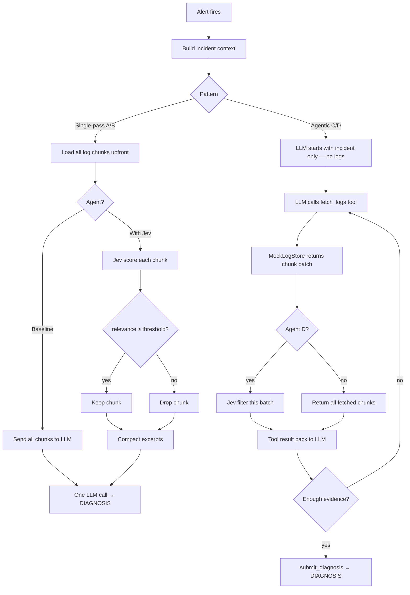

# Jev Log Relevance Filter

Benchmark and demo for using **Jev** (TypeSafe's System One model) to score log and trace chunks for anomaly relevance before they reach a diagnostic LLM — reducing tokens and cost without burying signal in noise.

Two patterns are compared: **single-pass** (filter then diagnose in one shot) and **agentic** (tool-calling loop that fetches logs on demand, with optional Jev filtering per fetch).

> **Scope:** All logs are mocked fixtures (`scenarios/`, `samples/`). This is not a production log pipeline — it validates the filtering pattern and measures savings reproducibly.

## The problem

Diagnostic agents often receive massive log exports or Datadog trace dumps. Stuffing everything into the LLM context window explodes **tokens, cost, and latency**. Most lines are noise.

## Four agents at a glance

| Agent | CLI name | Pattern | Jev | LLM calls | When to use |
| --- | --- | --- | --- | --- | --- |
| **A** | `baseline` | Single-pass | No | 1 | Upper bound — send everything |
| **B** | `with_jev` | Single-pass | Yes — filter all chunks upfront | 1 | Best token savings, fixed context |
| **C** | `agentic` | Tool loop | No | N | Fetch more logs if context is thin |
| **D** | `agentic_jev` | Tool loop | Yes — filter each fetch | N | On-demand fetch + compact excerpts |

All agents share the same LLM model, mocked scenarios, and diagnosis format (`DIAGNOSIS:` + root cause + evidence + action).

### Single-pass (Agents A & B)

```
All log chunks ──► [A] entire dump ──► LLM diagnosis
All log chunks ──► [B] Jev scores each chunk ──► high-signal only ──► LLM diagnosis
```

| | Agent A | Agent B |
| --- | --- | --- |
| Context | All log/trace chunks | Only relevance-filtered chunks |
| Jev role | None | `Noul` score per chunk: anomaly-relevant to this incident? |
| Code | `agents/baseline.py` | `agents/with_jev.py` |

### Agentic (Agents C & D)

ReAct loop — LLM starts with **incident context only** (no logs) and calls tools to gather evidence:

```
Alert → incident context (no logs)
  → fetch_logs(severity=ALL)     → excerpts returned
  → fetch_logs(severity=ERROR)   → more signal (if needed)
  → fetch_metrics()              → metrics summary
  → submit_diagnosis(...)        → done
```

Agent D applies Jev to each `fetch_logs` result before the LLM sees it. Code: `agents/agentic.py`, `tools/log_store.py`.

## End-to-end flow (alert → LLM response)



### Single-pass steps

| Step | What happens | In this repo |
| --- | --- | --- |
| 1. **Alert** | Pager/monitor fires | `scenario.incident` or `samples/incident-*.yaml` |
| 2. **Incident context** | Title, service, symptoms, metrics | `scenario.incident`, `metrics_summary` |
| 3. **Load logs** | Full export available upfront | `scenarios/*.yaml` or `samples/*.log` |
| 4. **Chunk** | Split into windows | Pre-chunked in YAML; `log_utils.chunk_by_blank_lines()` for samples |
| 5. **Score & filter** | Jev relevance filter (Agent B only) | `jev/chunk_scorer.py` |
| 6. **Diagnose** | One LLM call | `agents/baseline.py` or `agents/with_jev.py` |

### Agentic steps

| Step | What happens | In this repo |
| --- | --- | --- |
| 1. **Alert** | Same as above | Same |
| 2. **Incident context** | LLM sees incident — **no logs yet** | `agents/agentic.py` initial prompt |
| 3. **fetch_logs** | LLM requests logs (severity, time window) | `tools/log_store.py` |
| 4. **Filter batch** | Jev filters each fetch (Agent D only) | `ChunkRelevanceScorer` in tool handler |
| 5. **Reason & repeat** | Re-fetch or call `submit_diagnosis` | Loop up to `AGENT_MAX_TURNS` |

### Examples

**Single-pass (Agent B):**
```
Alert:     "Pod OOMKilled — report-generator"
Logs:      8 chunks (6 noise + 2 signal) → Jev keeps 2
LLM input: ~385 tokens (vs ~835 baseline)
Output:    DIAGNOSIS: heap OOM during batch export; recommend 512Mi limit
```

**Agentic (Agent C):**
```
Turn 1:  fetch_logs(severity=ERROR)  → 2 signal chunks
Turn 2:  fetch_metrics()             → memory 250-255Mi / 256Mi limit
Turn 3:  submit_diagnosis(...)       → DIAGNOSIS with evidence
```

## Quick start

```bash
python -m venv .venv && source .venv/bin/activate
pip install -r requirements.txt
cp .env.example .env   # set OPENAI_API_KEY, TYPESAFE_API_KEY

python scripts/smoke_test.py                              # offline, no keys
python scripts/test_sample_log.py                         # score one sample log
python scripts/test_agentic.py --scenario oom_heap_exhaustion   # tool loop
JEV_MODE=live python run_benchmark.py --runs 3            # full benchmark (A & B)
python run_benchmark.py --agents agentic,agentic_jev --runs 1 --scenarios oom_heap_exhaustion
```

Results: `results/REPORT.md`, `results/summary.json`, `results/charts/`

## Configuration

Copy `.env.example` to `.env`. Do **not** commit `.env`.

| Variable | Default | Description |
| --- | --- | --- |
| `OPENAI_API_KEY` | — | Required for LLM diagnosis and agentic tool calling |
| `LLM_MODEL` | `gpt-4o-mini` | Diagnostic LLM (`gpt-4o` recommended for benchmark) |
| `TYPESAFE_API_KEY` | — | Required for live Jev scoring (not needed in `mock` mode) |
| `JEV_MODE` | `mock` | `mock` = heuristics, `shadow` = score but pass all, `live` = filter |
| `RELEVANCE_THRESHOLD` | `0.65` | Chunks below this score are dropped in `live` mode |
| `AGENT_MAX_TURNS` | `8` | Max ReAct loop iterations for agentic agents |
| `BENCHMARK_RUNS` | `3` | Runs per scenario per agent |

## Scenarios (mocked logs & traces)

| Scenario | Signal buried in |
| --- | --- |
| `oom_heap_exhaustion` | OOM / heap errors among health checks |
| `crashloop_db_config` | Invalid DATABASE_URL among probe logs |
| `db_connection_cascade` | Connection refused among access logs |
| `prompt_injection_in_logs` | Injection line + NPE among routine logs |
| `routine_health_polls` | All noise — benign health-check traffic |
| `trace_latency_spike` | Slow DB span among normal traces |

Each scenario defines log chunks (`is_signal` for ground truth), incident context, and expected diagnosis keywords. Matching sample files live in `samples/`.

## Metrics

Benchmark reports compare agents on:

- **LLM input tokens** — primary savings metric (single-pass)
- **LLM calls per run** — higher for agentic agents (multi-turn)
- **Chunks passed** vs total fetched
- **Context compression %** — chars filtered out by Jev
- **Signal recall** — did all ground-truth signal chunks reach the LLM?
- **Correct diagnosis rate** — matches expected keywords
- **Jev calls** — one per chunk scored
- **Latency** p50 / p95

## Project layout

```
agents/           baseline.py, with_jev.py (single-pass), agentic.py (tool loop)
tools/            log_store.py — mock fetch_logs backend
jev/              chunk_scorer.py — Jev relevance scoring
scenarios/        YAML log-chunk fixtures (benchmark)
samples/          standalone .log files + incident YAML for manual testing
scripts/          smoke_test.py, test_sample_log.py, test_agentic.py, log_utils.py
benchmark/        runner, telemetry, metrics, report
results/          REPORT.md, summary.json, charts (results/raw/ is gitignored)
article/          write-up draft
```

## References

- [article/ARTICLE.md](article/ARTICLE.md) — experiment write-up and architectural notes
- [Building a Harness with Jev](https://www.langchain.com/blog/building-a-harness-with-jev)
- [langchain-typesafe](https://pypi.org/project/langchain-typesafe/)
