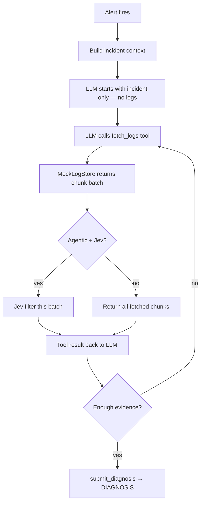

# Jev as a Decision Layer — Agentic Log Diagnosis Demo

**Experiment / demo** — compares the **same agentic investigator** with and without **Jev** (TypeSafe's System One model) as a decision layer on each log fetch. This is not a production diagnostic product.

> **Scope:** Mocked logs only (`scenarios/`, `samples/`). Same agent, same LLM — only the Jev filter is toggled (`agentic` vs `agentic_jev`).

## The problem

Diagnostic agents often receive massive log exports or Datadog trace dumps. Stuffing everything into the LLM context window explodes **tokens, cost, and latency**. Most lines are noise — and a single dump may not contain enough signal to diagnose.

## The approach

An **agentic loop**: the LLM starts with incident context only, calls tools to fetch evidence, and submits a diagnosis when ready. Jev optionally filters each fetch batch before the LLM sees it.

```
Alert → incident context (no logs yet)
  → LLM: fetch_logs(severity=ERROR)
  → [Jev filter batch] → tool result
  → LLM: fetch_metrics()
  → LLM: submit_diagnosis(...)
```

| | Agentic | Agentic + Jev |
| --- | --- | --- |
| CLI name | `agentic` | `agentic_jev` |
| Log access | `fetch_logs` tool (mock store) | Same |
| Per-fetch filtering | None — all fetched chunks shown | Jev scores each batch |
| LLM calls | Multiple (reason → act → observe) | Multiple |
| Recovery | Re-fetch with different filters if context is thin | Same + compact excerpts |

## How Jev decides what the LLM sees

Jev is **not** the diagnostic agent. It sits **between `fetch_logs` and the LLM** and filters each batch before the agent reads the tool result.

```
fetch_logs returns N chunks
  → for each chunk: score 0–1 vs active incident (title, service, symptoms)
  → pass if score ≥ RELEVANCE_THRESHOLD (0.65 in live mode)
  → only passed chunks go in the tool response → LLM
```

**Question Jev answers (via TypeSafe `Noul`):**  
*Does this log chunk contain anomaly signal that helps diagnose this incident?*

| Input per chunk | Output |
| --- | --- |
| Incident context + one log excerpt (≤4k chars) | Relevance score 0–1 → pass or drop |

**Example:** `heap out of memory` → **0.91 pass** · `health check OK` → **0.08 drop**

**Modes (`JEV_MODE`):**

| Mode | Behavior |
| --- | --- |
| `live` | Drop chunks below threshold (use this for real comparison) |
| `shadow` | Score only — all chunks still pass |
| `mock` | Keyword heuristics, no API key |

If live mode would drop **all** chunks in a batch, the top 1–2 by score are kept as a fallback.

**Jev does not** choose when to fetch or when to diagnose — the agent does. Code: `agents/agentic.py` (calls filter) · `jev/chunk_scorer.py` (scores chunks).

## End-to-end flow (alert → LLM response)



| Step | What happens | In this repo |
| --- | --- | --- |
| 1. **Alert** | Pager/monitor fires | `scenario.incident` or `samples/incident-*.yaml` |
| 2. **Incident context** | LLM sees incident — **no logs yet** | `agents/agentic.py` initial prompt |
| 3. **fetch_logs** | LLM requests logs (severity, time window) | `tools/log_store.py` |
| 4. **Filter batch** | Jev filters fetch (Agentic + Jev only) | `jev/chunk_scorer.py` in tool handler |
| 5. **Reason & repeat** | Re-fetch or call `submit_diagnosis` | Loop up to `AGENT_MAX_TURNS` |

### Example (Agentic + Jev)

```
Turn 1:  fetch_logs(severity=ERROR)  → Jev keeps 2 signal chunks
Turn 2:  fetch_metrics()             → memory 250-255Mi / 256Mi limit
Turn 3:  submit_diagnosis(...)       → DIAGNOSIS: heap OOM; recommend 512Mi limit
```

## Quick start

```bash
python -m venv .venv && source .venv/bin/activate
pip install -r requirements.txt
cp .env.example .env   # set OPENAI_API_KEY, TYPESAFE_API_KEY

python scripts/smoke_test.py                                    # offline, no keys
python scripts/test_agentic.py --scenario oom_heap_exhaustion     # one scenario
JEV_MODE=live python scripts/test_agentic.py --scenario oom_heap_exhaustion --jev
JEV_MODE=live python run_benchmark.py --runs 3                    # full benchmark (use live, not shadow)
```

Results: `results/REPORT.md`, `results/summary.json`, `results/charts/`

**Latest live run:** ~53% log compression, ~12% fewer LLM tokens, 100% signal recall — at the cost of ~12% higher latency (Jev calls per chunk).

## Configuration

Copy `.env.example` to `.env`. Do **not** commit `.env`.

| Variable | Default | Description |
| --- | --- | --- |
| `OPENAI_API_KEY` | — | Required for LLM + tool calling |
| `LLM_MODEL` | `gpt-4o-mini` | Diagnostic LLM (`gpt-4o` recommended for benchmark) |
| `TYPESAFE_API_KEY` | — | Required for live Jev scoring (not needed in `mock` mode) |
| `JEV_MODE` | `mock` | `mock` = heuristics, `shadow` = score but pass all, `live` = filter |
| `RELEVANCE_THRESHOLD` | `0.65` | Chunks below this score are dropped in `live` mode |
| `AGENT_MAX_TURNS` | `8` | Max ReAct loop iterations |
| `BENCHMARK_RUNS` | `3` | Runs per scenario per agent |

## Scenarios (mocked logs & traces)

| Scenario | Signal buried in |
| --- | --- |
| `oom_heap_exhaustion` | OOM / heap errors among health checks |
| `crashloop_db_config` | Invalid DATABASE_URL among probe logs |
| `db_connection_cascade` | Connection refused among access logs |
| `prompt_injection_in_logs` | Injection line + NPE among routine logs |
| `routine_health_polls` | All noise — benign health-check traffic |
| `trace_latency_spike` | Slow DB span among normal traces |
| `disk_full_deploy` | No space left on device during deploy |
| `tls_cert_expired` | x509 certificate expired on ingress |
| `rate_limit_storm` | 429 storm from payment-svc timeout / DB down |

Matching sample files in `samples/`. Score chunks offline: `python scripts/test_sample_log.py --list`.

## Metrics

- **LLM calls per run** — multi-turn agentic cost
- **LLM input tokens** — total across all turns
- **Chunks fetched / passed** — after optional Jev filter
- **Context compression %** — chars filtered by Jev per fetch
- **Signal recall** — ground-truth signal chunks reached the LLM
- **Correct diagnosis rate**
- **Jev calls** — one per chunk scored
- **Latency** p50 / p95

## Project layout

```
agents/           agentic.py (tool loop), common.py (shared utilities)
tools/            log_store.py — mock fetch_logs backend
jev/              chunk_scorer.py — Jev relevance scoring
scenarios/        YAML fixtures (benchmark)
samples/          standalone .log + incident YAML
scripts/          smoke_test.py, test_agentic.py, test_sample_log.py, log_utils.py
benchmark/        runner, telemetry, metrics, report
results/          REPORT.md, summary.json, charts (results/raw/ is gitignored)
article/          write-up draft
```

## References

- [article/ARTICLE.md](article/ARTICLE.md) — experiment write-up
- [Building a Harness with Jev](https://www.langchain.com/blog/building-a-harness-with-jev)
- [langchain-typesafe](https://pypi.org/project/langchain-typesafe/)
